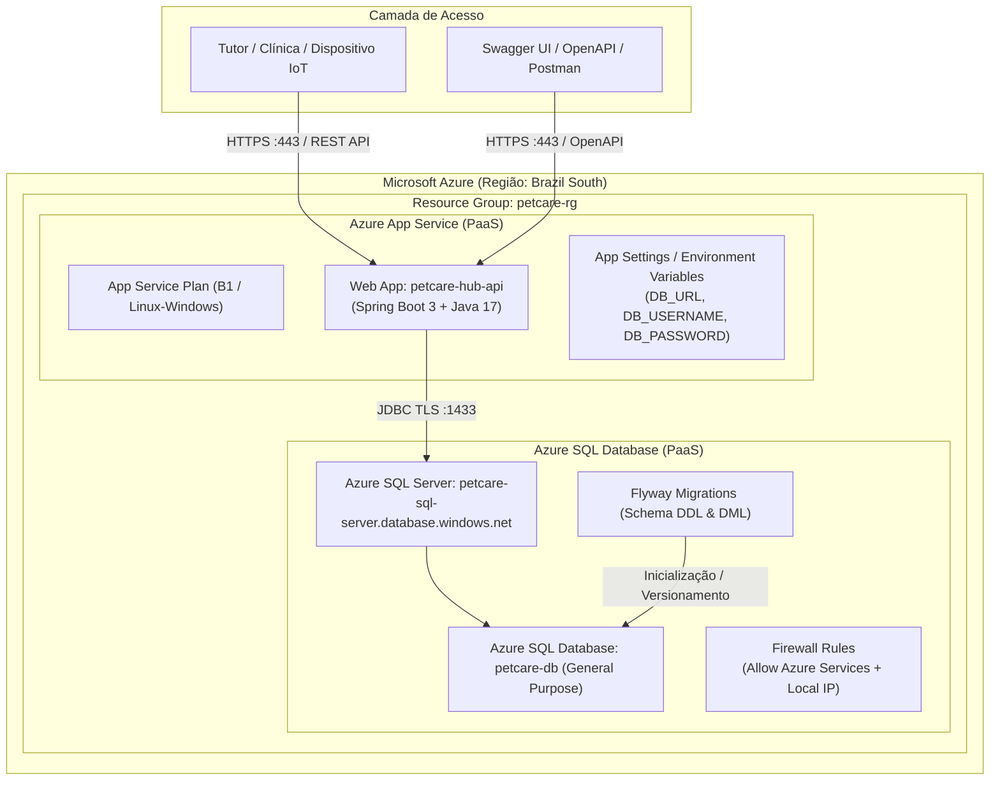

# PetCare Hub — DevOps Tools & Cloud Computing 

---

## 📌 1. Opção Escolhida

> **Opção 2 — Serviços de Aplicativos com Banco de Dados PaaS (Azure App Service + Azure SQL Database)**

- **Backend:** Spring Boot (Java 17) executado nativamente como serviço gerenciado no **Azure App Service (PaaS)**.
- **Banco de Dados:** **Azure SQL Database (PaaS)** totalmente gerenciado pela nuvem Azure, com versionamento e migrations automatizadas via Flyway.
- **Conformidade com os Requisitos:** Toda a aplicação e o banco utilizam **estritamente serviços PaaS**. **Não há containerização (sem Docker, ACR ou ACI)**, garantindo conformidade total e sem mistura de opções de entrega.

---

## 📖 2. Descrição da Solução

O **PetCare Hub** é uma plataforma inteligente e integrada para **monitoramento preventivo da saúde e bem-estar animal**, conectando tutores de pets e clínicas veterinárias em um ecossistema digital contínuo.

A solução é composta por:
1. **Telemetria e Monitoramento IoT Multi-Sensor:** Coleta em tempo real de dados de coleiras inteligentes (nível de atividade física e bateria), comedouros automatizados (consumo de ração em gramas e nível do dispenser) e sensores de ambiente residencial (temperatura, umidade e qualidade do ar).
2. **Cálculo de Score de Saúde:** Algoritmo preditivo que consolida as leituras em um índice de 0 a 100 com categorização semafórica (`VERDE`, `AMARELO`, `VERMELHO`).
3. **Gestão de Alertas Clínicos:** Notificação automática de anomalias e desvios de parâmetros vitais para intervenção precoce.
4. **Histórico e Protocolos Preventivos:** Agendamento e rastreamento de vacinas, vermífugos, exames, check-ups e consultas veterinárias.

---

## 💡 3. Descrição dos Benefícios para o Negócio

- **Detecção Precoce de Patologias:** Identifica alterações sutis na ingestão alimentar, desidratação, sedentarismo súbito ou estresse térmico antes que se tornem quadros clínicos graves.
- **Fidelização e Engajamento entre Clínicas e Tutores:** Cria um canal digital direto e contínuo, estimulando retornos e adesão ao calendário vacinal e preventivo.

---

## 🏗️ 4. Desenho da Arquitetura da Solução

A arquitetura foi projetada seguindo as melhores práticas de **Cloud Computing** e **DevOps**, utilizando recursos 100% gerenciados via **Azure CLI**:


---

## 🗄️ 5. Banco de Dados em Nuvem (Azure SQL Database - PaaS)

- **Serviço Utilizado:** Azure SQL Database (PaaS)
- **Arquivo DDL Entregue:** O script DDL completo, com todas as tabelas, colunas, chaves primárias, chaves estrangeiras, constraints, sequences, índices e comentários, está disponível no arquivo:
  - [`script_bd.sql`] e em [`database/script_bd.sql`].

### Tabelas CORE da Aplicação:
Todas as tabelas representam estritamente o núcleo do negócio de monitoramento e telemetria veterinária:
- `TUTOR`: Cadastro e autenticação do tutor responsável.
- `CLINICA`: Clínica veterinária vinculada.
- `PET`: Entidade central de monitoramento animal (relacionada a Tutor e Clínica).
- `CONSULTA`: Consultas, exames, diagnósticos e datas de retorno.
- `PROTOCOLO_PREVENTIVO`: Catálogo de protocolos (vacinas, vermífugos, check-ups).
- `EVENTO_PREVENTIVO`: Acompanhamento e histórico de eventos preventivos do Pet.
- `DISPOSITIVO_IOT`: Sensores vinculados ao animal (Coleira, Comedouro, Ambiente).
- `LEITURA_COLEIRA`: Telemetria de atividade física e bateria da coleira inteligente.
- `LEITURA_COMEDOURO`: Telemetria de nível de ração (%) e peso consumido (g).
- `LEITURA_AMBIENTE`: Sensores ambientais (temperatura °C, umidade % e qualidade do ar ppm).
- `ALERTA_SAUDE`: Alertas disparados por anomalias detectadas.
- `SCORE_SAUDE`: Índice preditivo de saúde consolidado.

---

## 🔄 6. Demonstração do CRUD nas Tabelas Core Relacionadas (`TUTOR` e `PET`)

O CRUD completo é implementado sobre as entidades core **`TUTOR`** (1) e **`PET`** (N), permitindo manipular registros com conteúdo significativo:

### 1. Inclusão (CREATE)
- **POST** `/api/tutores`:
  ```json
  {
    "nome": "Carlos Eduardo Silva",
    "email": "carlos.silva@email.com",
    "telefone": "11987654321",
    "cpf": "12345678901",
    "senha": "SenhaForte@123"
  }
  ```
- **POST** `/api/pets`:
  ```json
  {
    "idTutor": 1,
    "idClinica": 1,
    "nome": "Thor",
    "especie": "CAO",
    "raca": "Golden Retriever",
    "dataNascimento": "2021-05-10",
    "pesoKg": 32.5,
    "sexo": "M",
    "condicoesCronicas": "Displasia coxofemoral leve"
  }
  ```
- **Validação SQL:**
  ```sql
  SELECT * FROM dbo.TUTOR WHERE email = 'carlos.silva@email.com';
  SELECT * FROM dbo.PET WHERE nome = 'Thor';
  ```

---

### 2. Consulta (READ)
- **GET** `/api/tutores` e **GET** `/api/pets`
- **GET** `/api/tutores/1` e **GET** `/api/pets/1`
- **Validação SQL com JOIN:**
  ```sql
  SELECT t.id_tutor, t.nome AS nome_tutor, t.email, p.id_pet, p.nome AS nome_pet, p.especie, p.peso_kg
  FROM dbo.TUTOR t
  INNER JOIN dbo.PET p ON t.id_tutor = p.id_tutor;
  ```

---

### 3. Alteração (UPDATE)
- **PUT** `/api/pets/1`:
  ```json
  {
    "idTutor": 1,
    "idClinica": 1,
    "nome": "Thor Silva",
    "especie": "CAO",
    "raca": "Golden Retriever",
    "dataNascimento": "2021-05-10",
    "pesoKg": 33.2,
    "sexo": "M",
    "condicoesCronicas": "Displasia coxofemoral sob controle e fisioterapia"
  }
  ```
---

## 🛠️ 7. Scripts de Automação via Azure CLI (`script/`)

Todos os recursos de nuvem e processos de deploy são 100% automatizados por scripts em Shell Script utilizando a ferramenta oficial **Azure CLI (`az`)**:

| Script | Finalidade | Descrição Técnica |
| :--- | :--- | :--- |
| [`00-GERAR-CHAVES.sh`] | Segurança / Criptografia | Cria o diretório `Keys` e gera o par de chaves RSA (`private_key.pem` e `public_key.pem`) para autenticação e segurança do backend. |
| [`01-INFRAESTRUTURA-AZURE.sh`] | Provisionamento PaaS | Cria Resource Group (`petcare-rg`), Azure SQL Server (`petcare-sql-server`), Azure SQL Database (`petcare-db`), regras de firewall e Web App no Azure App Service com runtime Java 17. |
| [`02-CONFIGURAR-E-DEPLOY.sh`] | Build & Deploy | Injeta connection strings seguras no App Service, compila o backend com Maven (`mvn clean package -DskipTests`) e faz deploy do arquivo `.jar` no Azure. |
| [`03-VERIFICAR-AZURE.sh`] | Testes & Verificação | Consulta o status `Running`, obtém a URL pública HTTPS, valida configurações de Java e testa resposta HTTP da API. |
| [`04-DELETAR-INFRAESTRUTURA.sh`] | Cleanup / Exclusão | Remove completamente o Resource Group e todos os recursos criados (script de limpeza final). |

---

## 🚀 8. Guia Passo a Passo de Execução (How-To)

Execute os comandos a partir da pasta raiz do repositório (`devops`):

### 1. Dar Permissão aos Scripts
```bash
chmod +x script/*.sh
```

### 2. Autenticar no Azure
```bash
az login
```

### 3. Gerar Chaves Criptográficas (RSA)
Gera o par de chaves privada e pública exigido para inicialização segura da aplicação Spring Boot:
```bash
./script/00-GERAR-CHAVES.sh
```

### 4. Criar a Infraestrutura no Azure (PaaS)
```bash
./script/01-INFRAESTRUTURA-AZURE.sh
```

### 5. Configurar Variáveis e Realizar o Deploy
```bash
./script/02-CONFIGURAR-E-DEPLOY.sh
```

### 6. Verificar a Aplicação Publicada
```bash
./script/03-VERIFICAR-AZURE.sh
```

### 7. Acompanhar Logs em Tempo Real (Opcional)
```bash
az webapp log tail --resource-group petcare-rg --name petcare-hub-api
```

### 8. Excluir Recursos ao Final do Ciclo (Limpeza)
> [!CAUTION]
> Execute somente após o encerramento dos testes e gravação do vídeo.
```bash
./script/04-DELETAR-INFRAESTRUTURA.sh
```

---

## 🌐 9. Endpoints Públicos e Documentação

- **Swagger UI (Documentação Interativa):**
  [https://petcare-hub-api.azurewebsites.net/swagger-ui.html](https://petcare-hub-api.azurewebsites.net/swagger-ui.html)
- **OpenAPI Docs (JSON):**
  [https://petcare-hub-api.azurewebsites.net/v3/api-docs](https://petcare-hub-api.azurewebsites.net/v3/api-docs)

---

## 👥 10. Integrantes da Equipe

| Nome Completo | RM | Turma | GitHub | LinkedIn |
| :--- | :---: | :---: | :--- | :--- |
| **Alexander Dennis Isidro Mamani** | 565554 | 2TDSPG | [alex-isidro](https://github.com/alex-isidro) | [LinkedIn](https://www.linkedin.com/in/alexander-dennis-a3b48824b/) |
| **Kelson Zhang** | 563748 | 2TDSPG | [KelsonZh0](https://github.com/KelsonZh0) | [LinkedIn](https://www.linkedin.com/in/kelson-zhang-211456323/) |

---